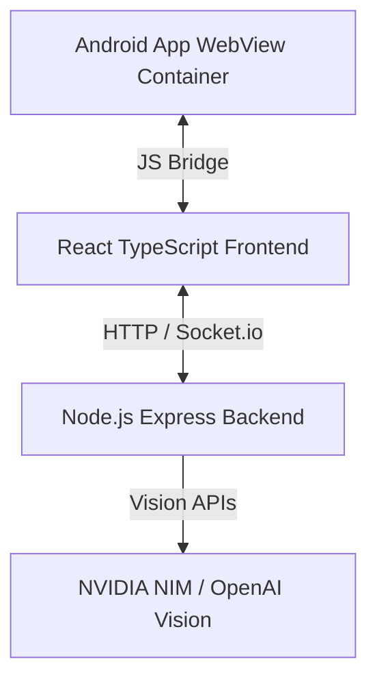

# Pothole Pulse 🕳️🚗
> **An Intelligent AI-Powered Road Hazard Detection and Civic Action Ecosystem.**

PotholePulse transforms every smartphone into a smart road sensor. Using the phone’s accelerometer, gyroscope, and GPS, our system continuously analyzes motion patterns while a vehicle is moving to detect potholes, speed breakers, and rough road surfaces in real time. An on-device AI model filters out normal driving vibrations and identifies genuine road anomalies without requiring additional hardware. Each detected event is automatically geotagged and uploaded to a shared road-health map, creating a continuously updated picture of road conditions. Instead of relying only on manual complaints or periodic road inspections, PotholePulse enables continuous, crowdsourced road monitoring. Authorities can identify high-risk locations, prioritize maintenance, and track recurring road damage, while drivers benefit from better awareness of hazardous stretches. Our vision: Turn every smartphone into a road sensor and build a living, data-driven map of road health.

---

## 🚀 Key Features

### 1. Drive Mode (Continuous Scanning)
- **Zero-Touch Telemetry:** Connects to the native Android device camera using a custom JS-to-Native bridge.
- **Continuous Defect Analysis:** Automatically inspects the road ahead while driving.

### 2. Manual Reporting & AI Vision Analysis
- **Location-Aware Capture:** Captures exact GPS coordinates (Latitude & Longitude) and looks up landmarks automatically using OpenStreetMap/Nominatim.
- **AI-Generated Official Complaint Drafting:** Sends images to AI Vision models (such as Llama 3.2 11B Vision or GPT-4o Mini) to analyze damage and draft a formal, professionally structured complaint letter.
- **Review Stage Back-Navigation:** Enables users to easily step back to correct images, adjust location markers, or tweak details before submission.

### 3. Settings, Dark Mode & Local Storage Control
- **Dynamic Dark/Light Mode:** Seamless toggle in the settings menu, shifting the app into a premium dark navy aesthetic (`#0f172a`).
- **Interactive Dataset & Storage Manager:**
  - **Live Count:** Displays active local telemetry counts.
  - **Review Frames:** Jumps directly to inspect logged road data.
  - **Export Dataset:** Packages all local pothole reports into a clean, downloadable `.json` file.
  - **Delete All App Data:** Clears server-side and client-side storage instantly (with confirmation warnings).

### 4. Robust Auth Portal
- **Swap-Optimized Sign Up & Sign In:** Clean split-tab onboarding interface defaulting to Sign Up first for new users.
- **Google OAuth Integration:** Pre-configured with Google Identity Services structure, ready for production client IDs.

---

## 🧠 YOLO Model & Road Defect Detection

The Android client (`pothole_app`) features an **on-device real-time machine learning pipeline** to detect potholes locally without relying on expensive server-side video streaming.

### 1. The Model: `pothole_model.tflite`
- **Architecture:** Lightweight **YOLO (You Only Look Once)** object detection model compiled into TensorFlow Lite format.
- **Input Dimensions:** 640x640 pixels (RGB).
- **Execution Performance:** Run utilizing Android CPU delegates configured with 4 execution threads, maintaining smooth real-time camera framing (averaging ~15-40ms inference).

### 2. Pre-processing & Inference (`YoloTFLiteDetector.kt`)
- Camera frames are dynamically intercepted from the native camera stream, rotated, and processed into a `TensorImage`.
- An `ImageProcessor` applies a bilinear resize to scale the image to 640x640, followed by range normalization (dividing pixel values by 255 to yield `0f` to `1f` floats).
- The normalized buffer is fed into the TFLite Interpreter which executes the neural network forwards pass.

### 3. Post-processing & Filtering
- **Threshold Filtering:** Detections are ignored if the model confidence score falls below a threshold of `0.4`.
- **Non-Maximum Suppression (NMS):** To prevent duplicate boxes for the same pothole, a custom NMS algorithm matches overlapping boxes and suppresses redundant candidates using an Intersection over Union (IoU) threshold of `0.3`.

### 4. Automated Reporting Pipeline
When a hazard is successfully detected:
1. The app initializes a 15-second cooldown timer to prevent spamming reports for the same pothole.
2. The detected bitmap frame is encoded into a Base64 data URL string.
3. The app issues an HTTP POST request containing the frame and approximate coordinates to the backend proxy.
4. The proxy requests a Vision analysis, generates the complaint letter, and broadcasts the event via WebSockets to instantly update all active web dashboards.

---

## 🛠️ Architecture & Tech Stack



- **Frontend:** React 19, TypeScript, Vite, Leaflet Maps
- **Backend:** Node.js, Express, Socket.io (In-memory caching for real-time dashboard sync)
- **Mobile Container:** Kotlin Native Android App wrapper

---

## 📦 Project Directory Structure

```
Pothole-Pulse/
│
├── backend/                    # Node.js express server with Socket.io updates
│   ├── server.js               # Main server logic, proxy routes, and AI Vision connections
│   ├── package.json            # Backend dependency details
│   └── package-lock.json
│
├── civic_dashboard/            # React + TypeScript Dashboard (Vite)
│   ├── src/
│   │   ├── components/         # Modular React components
│   │   │   ├── Login.tsx       # Secure Auth Portal with tabs (Sign In & Sign Up)
│   │   │   ├── AIAgent.tsx     # Localized AI Copilot chat components
│   │   │   ├── incidentTable.tsx # Live list of civic events
│   │   │   └── Heatmap.tsx     # Leaflet map visualizations
│   │   ├── App.tsx             # Main dashboard core (tabs, state management, details modal)
│   │   ├── index.css           # Global custom theme styles & animations
│   │   └── main.tsx            # React mounting hook
│   ├── index.html              # Core HTML structure & GIS scripts
│   ├── package.json            # Web dependency configuration
│   └── vite.config.ts          # Vite build instructions
│
└── pothole_app/                # Mobile Container Application (Android Studio)
    └── PotholeDetectionApp/    # Native shell with YOLO camera bridge
        └── app/src/main/
            ├── AndroidManifest.xml # Device permission declarations (GPS, Camera)
            └── java/com/.../
                └── MainActivity.kt # Android lifecycle, frame processing & auto-report task
```

---

## ⚙️ Setup & Installation

### 1. Run the Backend Sync Server
```bash
cd backend
npm install
node server.js
```
*Listens on port `3000`.*

### 2. Start the Frontend Dashboard
```bash
cd civic_dashboard
npm install
npm run dev
```
*Listens on port `5173`. Access it at `http://localhost:5173`.*

### 3. Connect the Android App
1. Open the `/pothole_app` folder in **Android Studio**.
2. Change the target URL in your network config to match your workstation's local IP address (e.g. `http://192.168.1.XX:5173`).
3. Run on your physical device to enable GPS tracking.
345


